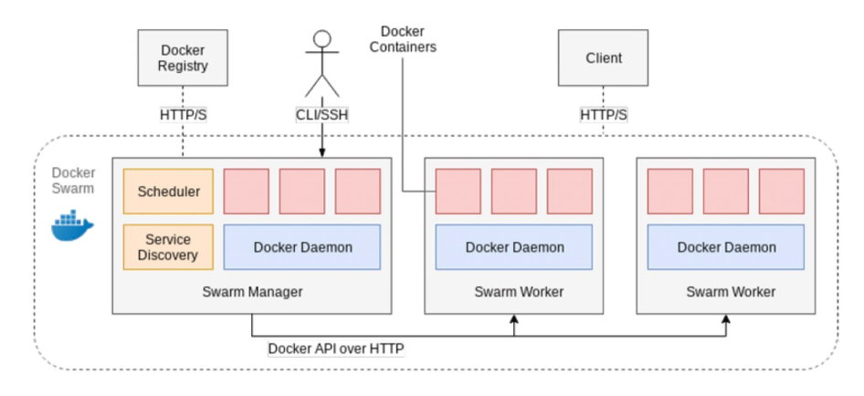
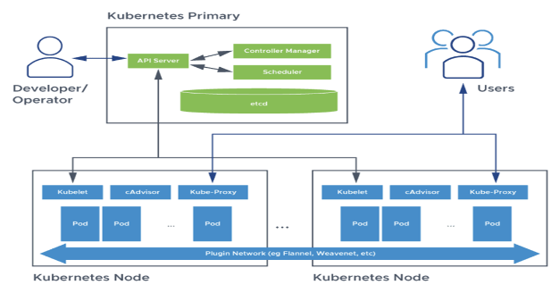

# Orchestrating Containers: A Comparative Study

This project presents a comprehensive analysis of popular container orchestration platforms: Docker Swarm, Kubernetes, and OpenShift. By comparing their metrics and monitoring capabilities, we aim to provide insights into their performance, resource utilization, and availability to help users make informed decisions for their container orchestration needs.

## Introduction

Container orchestration is a critical aspect of modern software engineering, enabling the management, scaling, and monitoring of containerized applications. This study evaluates Docker Swarm, Kubernetes, and OpenShift, highlighting their strengths, weaknesses, and monitoring capabilities.

## Application Architecture

<!--  -->

<!--  -->

We utilized a sample voting application for our study, comprising:

- A front-end web app in Python for voting between two options.
- Redis for collecting new votes.
- A .NET worker for processing votes and storing them in a Postgres database.
- A Node.js web app for displaying voting results in real time.

## Platform Comparisons

### Docker Swarm

<!--  -->

<!--  -->

Docker Swarm, the native clustering and orchestration tool by Docker, offers simplicity and ease of deployment. We deployed a sample voting application using Swarmpit for management and conducted load testing to analyze performance metrics.

### Kubernetes

<!--  -->

<!--  -->

Known for its flexibility and vast ecosystem, Kubernetes supports both single-node and multi-node architectures. We used Prometheus and Grafana for monitoring and conducted load testing to assess its scalability and high availability features.

### OpenShift

As an enterprise-grade version of Kubernetes, OpenShift provides a secure and scalable platform with additional features. We deployed our application in a single-node architecture and monitored CPU and memory usage through the built-in dashboard.

## Metrics Comparison

Our comparison focuses on CPU usage, memory usage, ease of deployment, fault tolerance, scaling, and load balancing across the three platforms. Key findings include:

- **CPU Usage:** Docker Swarm showed the lowest CPU usage, with Kubernetes and OpenShift requiring more resources.
- **Memory Usage:** Docker Swarm had the most efficient memory usage, with Kubernetes and OpenShift displaying similar patterns.
- **Ease of Deployment:** Docker Swarm excels in simplicity, whereas Kubernetes offers complexity with more features, and OpenShift provides an easy deployment process with a repository.

## Conclusion

Each platform has its unique advantages and suitability for different project requirements. Docker Swarm is ideal for simple, lightweight applications; Kubernetes offers greater flexibility for complex systems; and OpenShift is best suited for enterprise-level applications seeking additional features atop Kubernetes.
